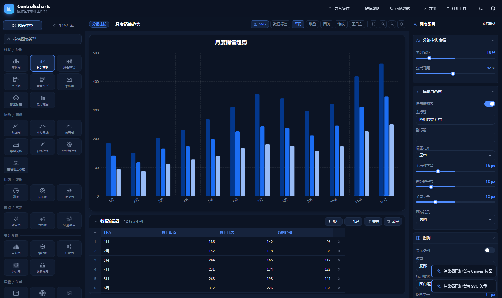
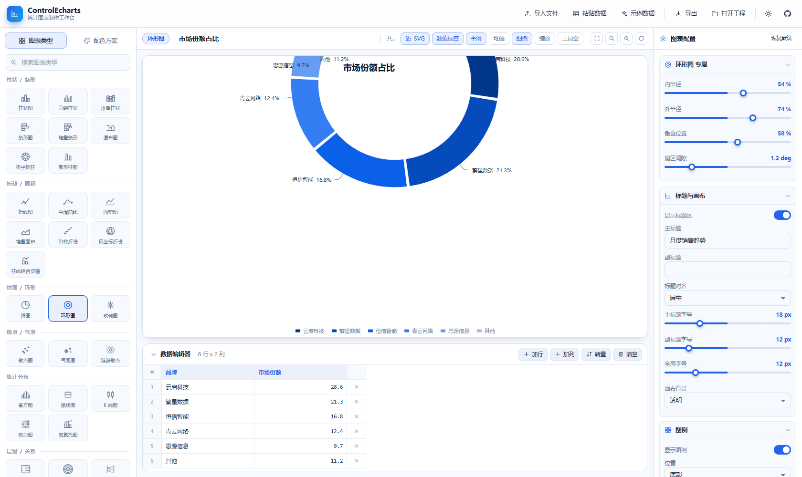

# ControlEcharts

基于 **Tailwind CSS** 与 **Apache ECharts** 的统计图表制作工作台。纯前端、零构建、双击即用，所有依赖已本地化，离线环境同样可以运行。



## 特性

- **38 种统计图表**，覆盖 8 大类：柱状 / 条形、折线 / 面积、饼图 / 环形、散点 / 气泡、统计分布、层级 / 关系、仪表 / 流程、多维 / 特殊。
- **SVG 矢量渲染器**为默认输出，导出的 SVG 可无损缩放、可直接进排版软件；亦可一键切换 Canvas。
- **数据导入方式齐全**：手动表格录入、粘贴文本、CSV / TSV / JSON 文件、拖拽到画布、从 Excel / WPS 直接复制粘贴。
- **单色 / 多色 / 自定义三套配色体系**：单色模式基于 HSL 自动生成与数据项数量等长的色阶；多色内置 16 套方案；自定义支持逐色编辑与随机扰动。
- **完整配置面板**：标题、图例、提示框、数据标签、坐标轴、图形样式、交互动画，共 60 余项参数实时生效。
- **多格式导出**：PNG（2 倍像素密度）、SVG 矢量、数据 CSV、工程 JSON、ECharts option 代码、可直接部署的独立 HTML。
- **双主题界面**：深色 / 浅色随界面切换，图表内部配色同步适配。
- **无 emoji**：界面与图标全部使用内联 SVG 绘制。
- **自动保存**：数据与配置写入本地存储，刷新后自动恢复。



## 快速开始

无需安装任何依赖，直接用浏览器打开 `index.html` 即可。

```bash
git clone https://github.com/yxpil/ControlEcharts.git
cd ControlEcharts
# Windows 下双击 index.html，或
start index.html
```

推荐通过本地静态服务访问以获得完整体验：

```bash
python -m http.server 8080
# 浏览器访问 http://localhost:8080
```

## 图表类型清单

| 分组 | 类型 |
| --- | --- |
| 柱状 / 条形 | 柱状图、分组柱状、堆叠柱状、条形图、堆叠条形、瀑布图、极坐标柱、象形柱图 |
| 折线 / 面积 | 折线图、平滑曲线、面积图、堆叠面积、阶梯折线、极坐标折线、柱线组合双轴 |
| 饼图 / 环形 | 饼图、环形图、玫瑰图 |
| 散点 / 气泡 | 散点图、气泡图、涟漪散点 |
| 统计分布 | 直方图、箱线图、K 线图、热力图、帕累托图 |
| 层级 / 关系 | 矩形树图、旭日图、桑基图、关系图、主题河流、树图 |
| 仪表 / 流程 | 仪表盘、漏斗图、标签云 |
| 多维 / 特殊 | 雷达图、平行坐标、日历热力图 |

每种图表都标注了所需的**数据形态**（例如「分类 + 多系列」「源 + 目标 + 权重」「三列矩阵」），切换类型时会自动按形态适配当前数据。

## 数据形态约定

| 数据形态 | 说明 | 典型图表 |
| --- | --- | --- |
| 分类 + 多系列 | 首列为分类名，其余数值列各成一系列 | 柱状、折线、雷达 |
| 名称 + 单值 | 名称列与数值列各一 | 饼图、漏斗、仪表盘 |
| 双数值 / 三数值列 | 两列作坐标，第三列映射气泡大小 | 散点、气泡 |
| 源 + 目标 + 权重 | 三列分别表示起点、终点、流量 | 桑基图、关系图、树图 |
| 三列矩阵 | 前两列为交叉维度，第三列为数值 | 热力图 |
| 日期 + OHLC | 日期与开、收、低、高四列 | K 线图 |
| 日期 + 数值 | 日期字符串与数值列 | 日历热力图 |

## 导入与导出

**导入**

- 顶部「导入文件」：CSV / TSV / TXT / JSON
- 顶部「粘贴数据」：任意分隔符文本，分隔符可自动识别，支持引号包裹与双引号转义
- 直接把文件拖到图表画布上
- 在数据表格中按 `Ctrl + V` 粘贴 Excel 区域，会从当前单元格开始批量填充
- 「打开工程」载入此前导出的 JSON 工程文件

**导出**

| 格式 | 说明 |
| --- | --- |
| PNG | 2 倍像素密度位图 |
| SVG | 矢量图，含背景色处理 |
| CSV | 当前数据集 |
| JSON | 完整工程（数据 + 配置 + 配色 + 图表类型） |
| ECharts option | 保留格式化函数的 JS 对象字面量 |
| 独立 HTML | 可直接部署的单文件页面 |

## 目录结构

```
ControlEcharts/
├── index.html          入口页面与 SVG 图标库
├── css/style.css       设计系统（CSS 变量驱动双主题）
├── js/
│   ├── palettes.js     配色引擎：单色色阶 / 多色方案 / 色彩工具
│   ├── data.js         数据模型、CSV 解析器、示例数据集
│   ├── chart-core.js   图表内核：注册表、主题、数据适配器、option 片段
│   ├── charts-a.js     柱状 / 条形、折线 / 面积、组合图
│   ├── charts-b.js     饼图 / 环形、散点 / 气泡、统计分布
│   ├── charts-c.js     层级 / 关系、仪表 / 流程、多维 / 特殊
│   ├── app.js          应用内核：状态、配置 Schema、渲染
│   └── app-ui.js       界面交互：面板、表格、导入导出、事件
└── vendor/             本地化的 echarts 与 tailwind
```

## 新增一种图表类型

在 `charts-*.js` 中调用 `ChartCore.register` 即可，画廊、搜索、配置面板与导出会自动接入。

```js
ChartCore.register({
  id: 'my-chart',
  name: '我的图表',
  group: '柱状 / 条形',
  icon: 'i-bar',                  // 指向 index.html 中的 SVG symbol
  shape: '分类 + 多系列',          // 数据形态说明
  preset: { stack: false },       // 切换到该类型时应用的默认项
  extra: [                        // 该类型专属的配置项
    { key: 'mySize', label: '尺寸', type: 'range', min: 4, max: 40, step: 1, unit: 'px', def: 12 }
  ],
  build: function (ds, cfg, ctx) {
    const cs = ChartCore.catSeries(ds);
    if (!cs.series.length) return null;   // 数据不匹配时返回 null
    const option = ChartCore.base(cfg, ctx);
    option.series = [];
    return option;
  }
});
```

## 兼容性

- Chrome / Edge 90+、Firefox 90+、Safari 14+
- 依赖均已本地化到 `vendor/`，可在内网与离线环境使用

## 许可证

[MIT](LICENSE)

---

<div align="center">

<a href="https://github.com/yxpil/ControlEcharts">
  
</a>

<sub>Powered by <a href="https://alittlecatgirlpanel.yxp.hk"><b>gh-card</b></a> · 粉色手写体 README 仓库名片</sub>

</div>
